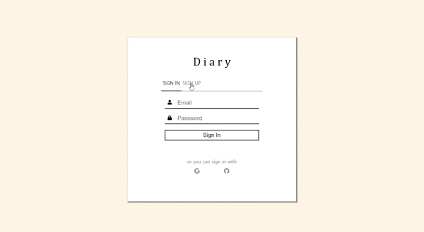
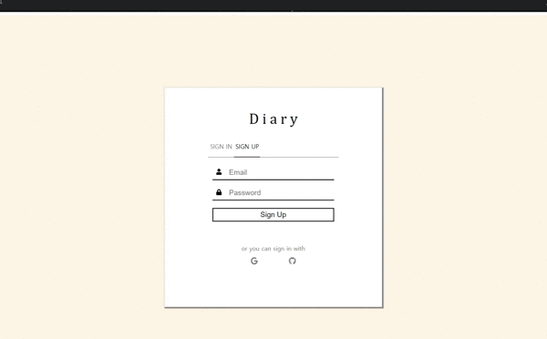
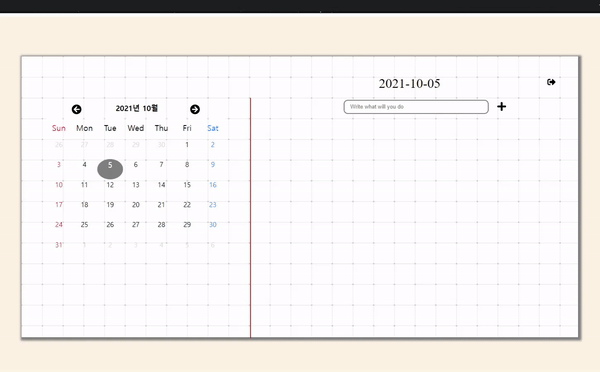

# Diary

## Why Diary ❓

처음으로 하는 토이 프로젝트라서 간단한 프로젝트를 찾았고 TodoList만 하기엔 아쉬워서 날짜를 선택과 로그인 기능을 추가해보고자 했다.

## 🚩 프로젝트 기간

2021년 9월 14일 ~ 10월 5일 (3주)

## 📕 사용 기술

- HTML
- CSS
- <b>React</b>
- <b>Firebase</b>

## 💻 구현 페이지

- 로그인/ 회원가입

  - 이메일/비밀번호 로그인 및 회원가입
  - 구글, 깃허브 로그인(OAuth)
  - Firebase의 Authentication 사용
     
     

- 메인 페이지
  - 로그아웃
  - 달력, 날짜 선택
  - TodoList

## 🎥 시연 이미지

1. 로그인/ 회원가입

   
   

2. 메인 페이지

   
   
   
## 📄 호스팅 주소

  - [Diary](https://kangsw1025.github.io/Diary)
